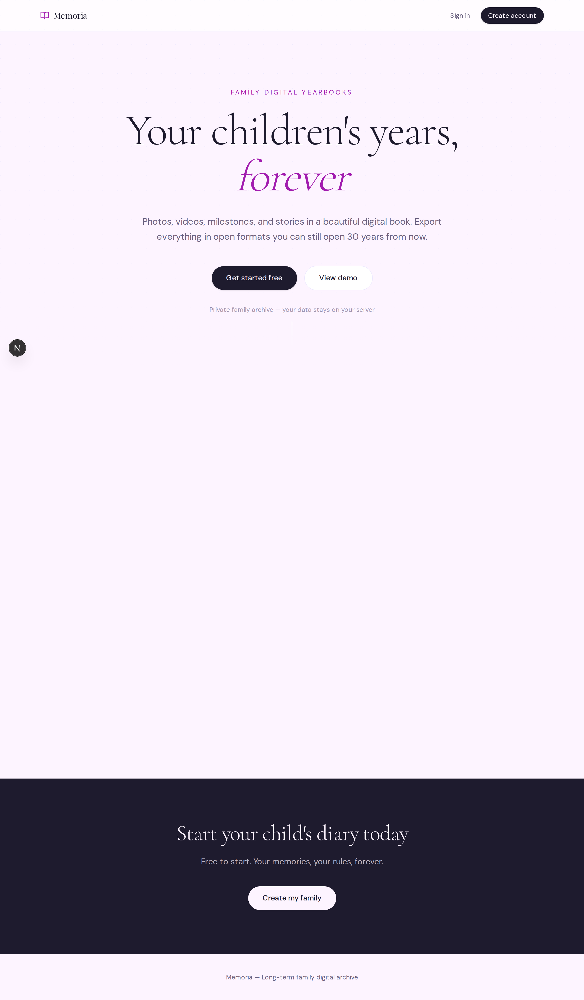
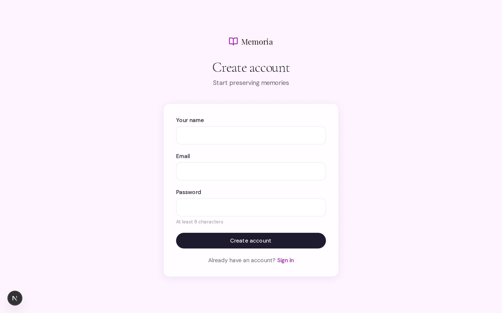
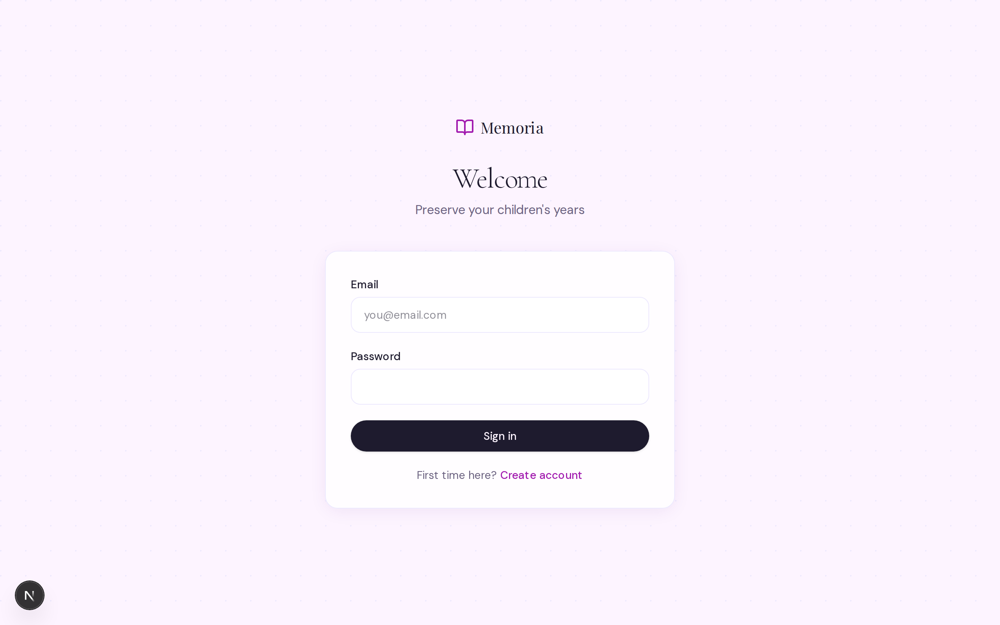

# Memoria

A private, self-hosted app for family yearbooks — photos, milestones, stories, and timelines for each child, with full export to open formats.

<p align="center">
  
</p>

## What you get

- **One profile per child** with their own theme color and life years
- **Rich yearbook editor** — milestones, stories, timeline events, future letters
- **Photos and videos** stored on your machine (`./storage/`)
- **Export** to PDF, offline HTML, JSON, or a full ZIP archive
- **Phone-friendly** — works on your home Wi‑Fi or over Tailscale

Your family's data never leaves your server. There is no demo content in this repo.

## Quick start (MacBook)

Designed to run on an always-on Mac (M1+) as the family server.

```bash
git clone https://github.com/pablogd-hashi/edsef.git
cd edsef
chmod +x scripts/prod/*.sh
./scripts/prod/setup-mac.sh   # creates .env, migrates DB, builds
./scripts/prod/start.sh       # starts Postgres + app on :3000
```

Then open **http://localhost:3000/register**, create your account, and add your first child from the dashboard.

| After first login | Command |
|-------------------|---------|
| Start | `npm run prod:start` |
| Stop Docker | `npm run prod:stop` |
| Update after `git pull` | `npm run prod:update` |
| Backup DB + photos | `npm run prod:backup` |

Set `ALLOW_REGISTRATION=false` in `.env` once your account exists.

**iPhone won't connect?** See [docs/remote-access.md](docs/remote-access.md).  
**Full production guide:** [docs/production-mac.md](docs/production-mac.md).

## Local development

```bash
cp .env.example .env
docker compose -f docker-compose.local.yml up -d
npm install
npx prisma migrate deploy
npm run dev
```

Open http://localhost:3000/register. Details: [docs/local-setup.md](docs/local-setup.md).

<p align="center">
  
  &nbsp;&nbsp;
  
</p>

## Privacy

Never commit these to git (already in `.gitignore`):

- `.env` — passwords and secrets
- `storage/` — photos and videos
- `backups/` — database dumps

## Stack

Next.js 16 · React 19 · PostgreSQL · Prisma · Auth.js · local disk storage

## Docs

| Guide | When you need it |
|-------|------------------|
| [production-mac.md](docs/production-mac.md) | Running on your Mac 24/7 |
| [remote-access.md](docs/remote-access.md) | iPhone, iPad, or away from home |
| [local-setup.md](docs/local-setup.md) | Hacking on the code locally |

## License

Private — family use only.
